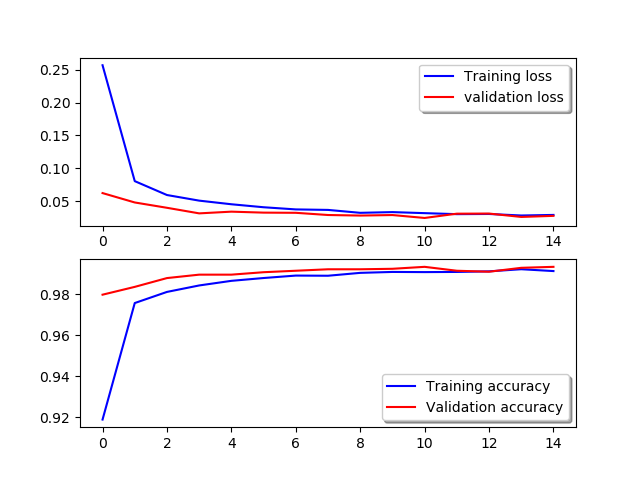
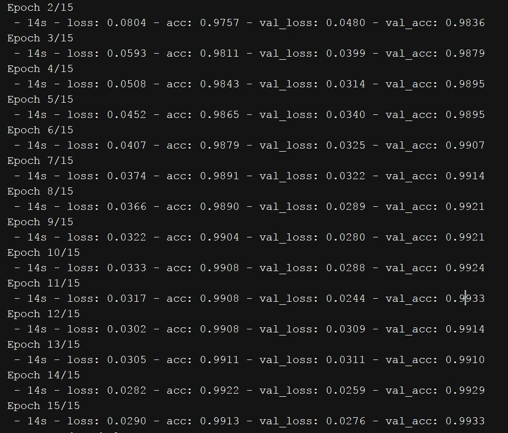

### Digit Recognizer

A simple and efficient digit recognizer tool using **Convolutional Neural Networks** implemented through **Keras**.
Accuracy is **99%+** and it takes 4-5 minutes to train using **tensorflow-gpu** as backend for Keras.
Without convolutional neural networks, accuracy was 95% and it took 10-15 minutes to train. 
This shows the effectiveness of convolutional networks over simple neural networks.

